# PWDer
PWDer is a simple password manager for the M5Cardputer. Its name is a combination of a few words:
- PWD (password)
- Manager
- Cardputer
and in order to not break your tongue, you can pronounce it as "Powder".

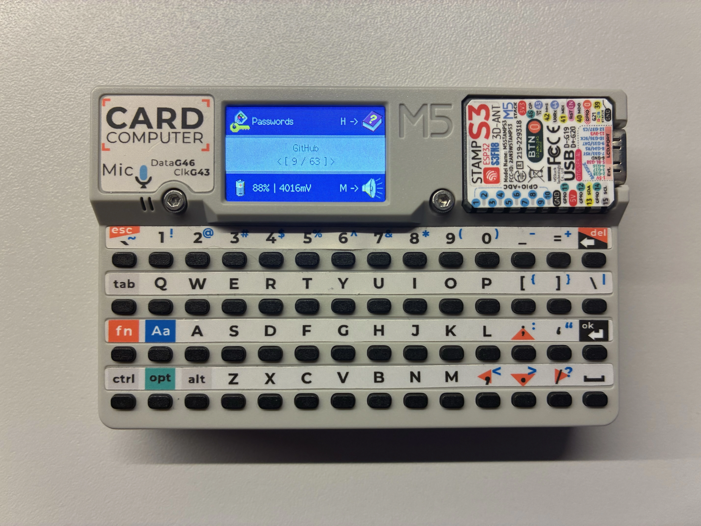

It started as an idea to solve the problem of the meticulous process of logging into personal accounts on different public computers (like school or work), where you don't have your password manager. It simulates a USB keyboard, entering the passwords for you into every computer you plug it in to. I thought of portable / cloud password managers only when I was halfway through doing this project, so I decided to continue it.
# Key functionalities
- Storing up to 100 passwords using AES128 encryption
- Protection with master password
- Searching for passwords by entry name
- Automatic password input to your computer using USB cable
- Synchronizing with .kdbx (KeePass) files over network\* or via SD card
- Elegant, simple design

\* Network transfer is not yet encrypted - its usage is highly discouraged unless you're the only user of your local network. Synchronize at your own risk.
# Setting it up
## Prerequisites
- I highly recommend using [Launcher](https://github.com/bmorcelli/Launcher) for running the program. However, it can be flashed and used directly too.
- A .kdbx database is required to import passwords into the Cardputer. Your computer also has to be able to run Python scripts. (This requirement will disappear once I add manual password entering)
## Step 1: Preparing the SD card
- Format an SD card using the **FAT32** file system
## Step 2: Installing PWDer on the Cardputer
- Set up an Arduino IDE for [programming the Cardputer](https://docs.m5stack.com/en/arduino/m5cardputer/program)
- Download the source code and open the `PWDer.ino` file with Arduino IDE
- Open up `enckey.cpp` and set the value of `char* enckey` to a set of 16 random lowercase letters
- Flash the program into the Cardputer or Export Compiled Program (if you're going to use Launcher) by pressing Ctrl+Alt+S
- *Optional: If you chose the second option, move the exported .bin file to the SD card*
- Make sure the SD card is in, then turn on the Cardputer
## Step 3: First run
- If you're using launcher, install the .bin file. Otherwise, wait until the program asks for the password.
- The first run password is "default". Enter it and press OK, you'll see the "Nothing" screen - the default and only password entry if the passwords file was nonexistent.
## Step 4: Importing the passwords for the first time
- Prepare your .kdbx database
- Open your terminal in `pwder_keepass_sync` directory
- Create a Python virtual environment and install dependencies
```bash
python3 -m venv .
source ./bin/activate
pip install pykeepass
```
(next time you try to use the script, just enter `source ./bin/activate`)
- Run the script
```bash
python3 main.py /your/database.kdbx --genfile
```
- A `pwimport` file will appear. Move it to the root directory of your SD card and insert the card into the Cardputer.
- Turn on or reset the Cardputer. It will prompt you to import the passwords. Press Y.
- Otherwise, you can just create the `pwimport` file manually with following syntax
```
title_1
username_1
password_1
title_2
username_2
password_2
title_n
username_n
password_n
```
- This won't be possible once encrypted password importing will be implemented. Make sure `\n` (LF) is being used (and not `\r\n` (CR LF)).
# Usage
## Main screen
This is where you can select a password to enter.


Press the arrow keys to navigate, and hold down V to preview the username and password you're about to enter. Connect the Cardputer to your computer and do one of these things:
- Pressing 1 will enter the username for currently selected entry
- Pressing 2 will enter the password
- Pressing 3 will enter the username, then press TAB, then enter the password, and then press Enter
- Pressing Enter will perform one of these three actions, depending on the selection made in Options.
- Pressing T will simulate pressing TAB on the computer.
- Pressing R will simulate pressing Enter on the computer.
- Pressing M will mute or unmute the speaker. The default state for the speaker is muted.
- Pressing L will lock the device. Alternatively, you can just reset the device.
- Pressing S will attempt to synchronize the passwords over the network.
- Pressing O will open Options.
- Pressing C will open Credits.
- Pressing Q will open Search menu (press Fn+Esc to exit)
## Lock screen
Here you have to enter the correct password (then press OK) to access the device. If you've locked yourself out, you can remove the `pwder/config` file from the SD card (the password will be "default" again), but keep in mind that all your saved passwords and configuration will disappear!

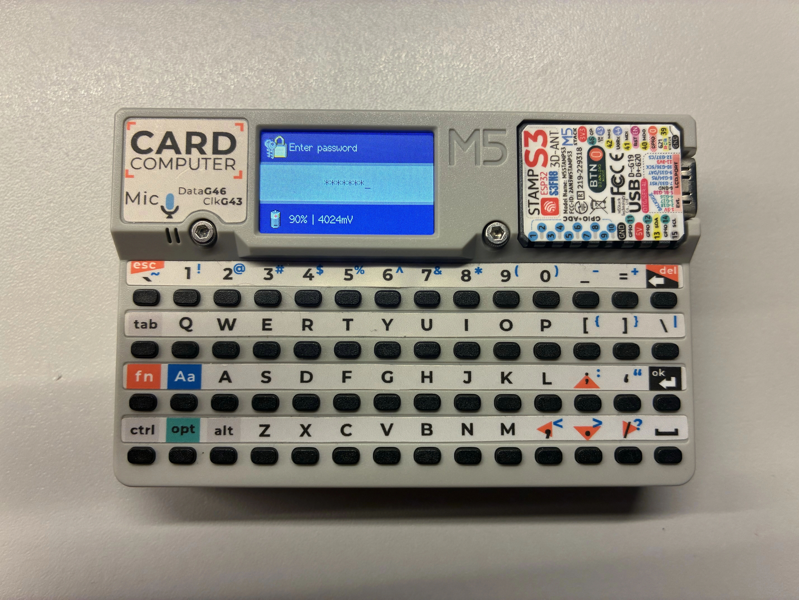

## Help screen
A help screen is a quick and complex guide to all the keybindings. Press the arrow keys / esc to navigate.

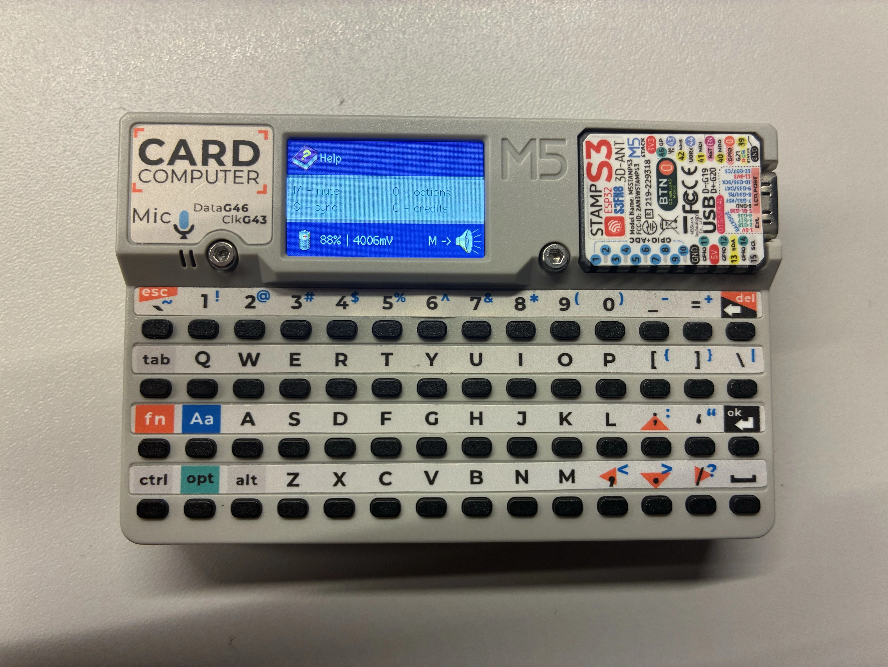

## Options screen
Press O to open the options screen.

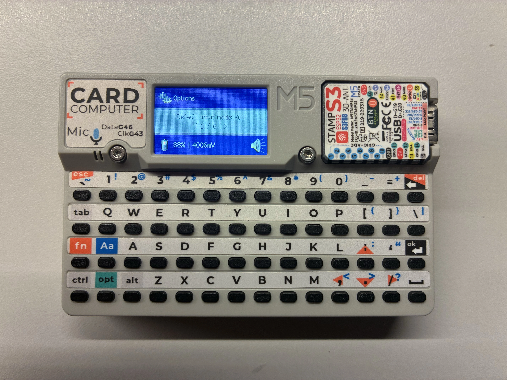

Press enter to switch between default password input modes.

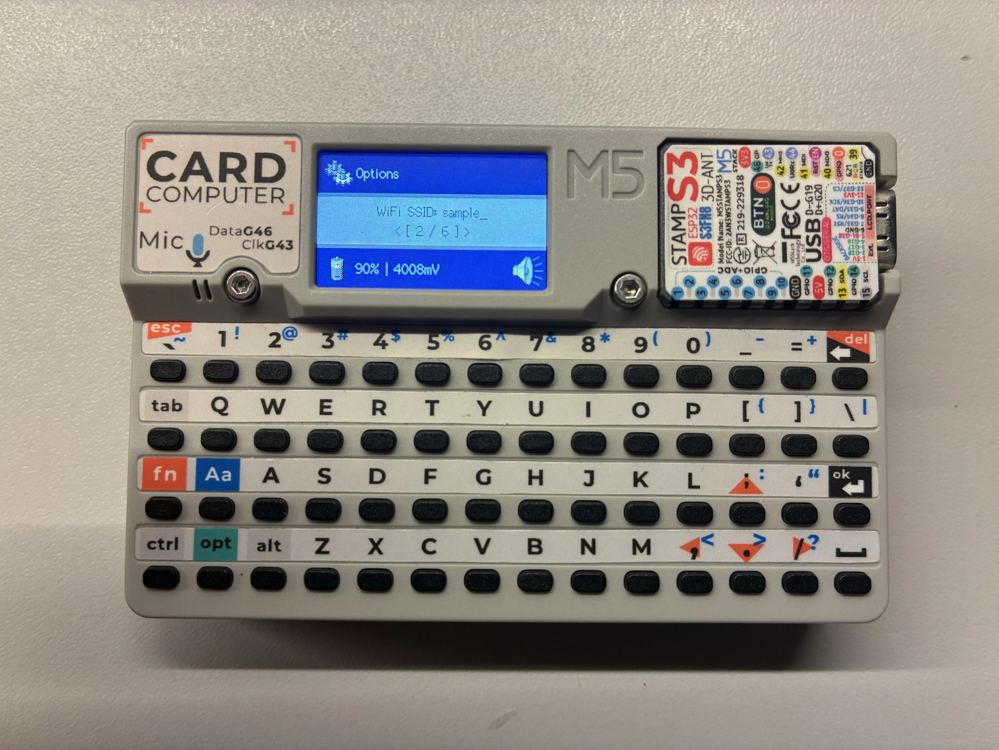

On pages that require complex typing (so basically anything else than switching the default password input mode), you need to hold FN when pressing arrow keys / esc to navigate.

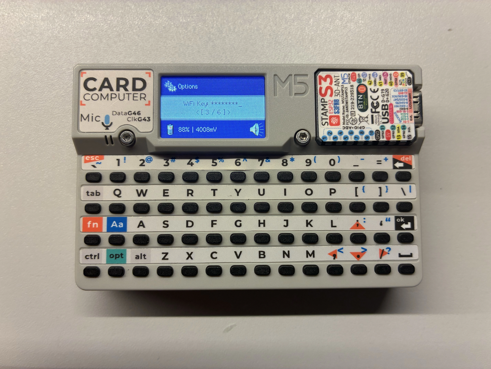

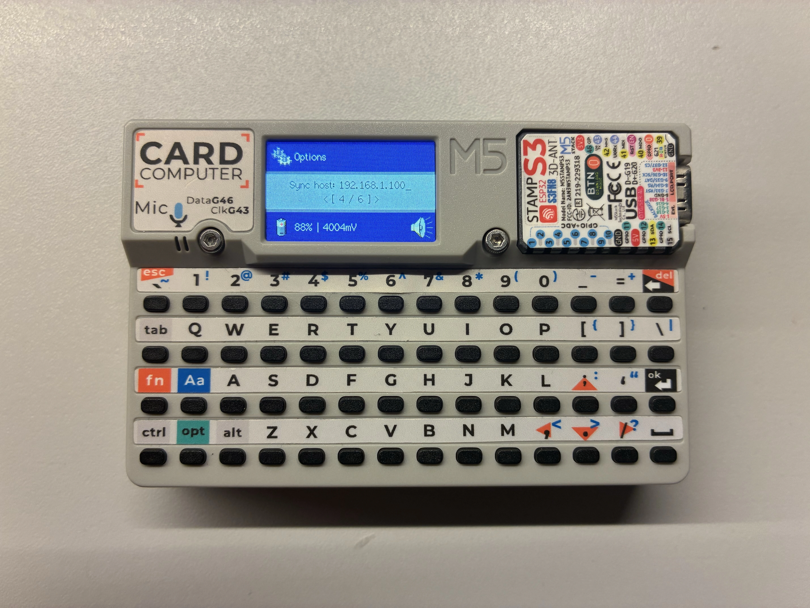

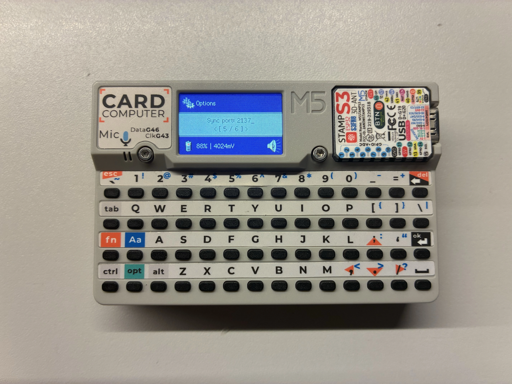

After changing a property, press Enter to save it. Additionally, after changing the device password, you'll be prompred to enter the current password. Press FN+Esc or enter an incorrect password to cancel the procedure.


## Network synchronization screen
Before accessing this screen, make sure the Wi-Fi settings in Options are set correctly and that the Python server is running, otherwise the procedure will fail. It will attempt to download the password data from the network and import it. Proceed with caution as it is not encrypted!

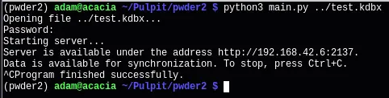

Hosting an unencrypted synchronization over network.

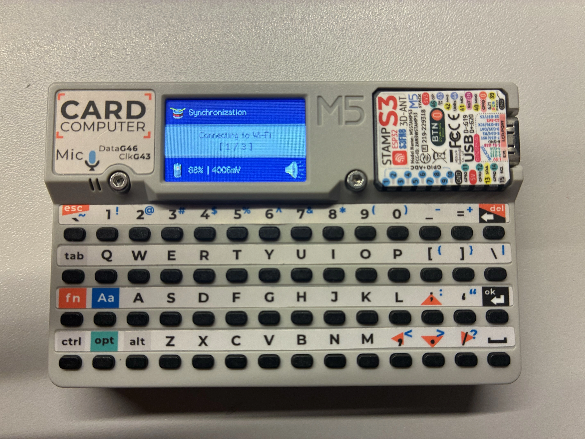

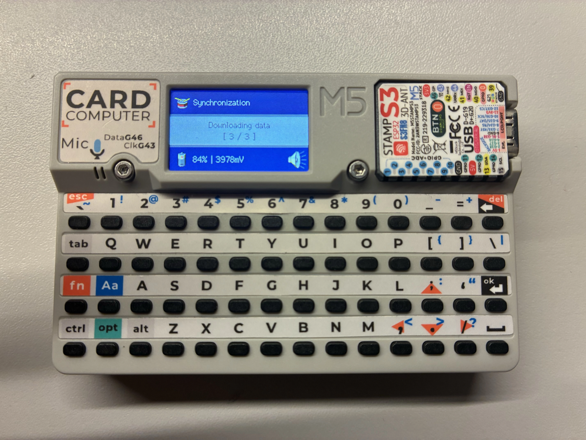

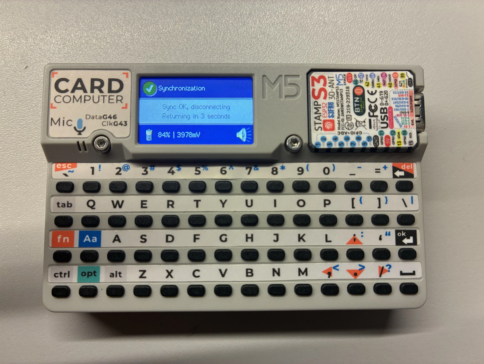

## Credits screen
Well, credits are credits. Press the arrow keys / esc to navigate. Pressing Enter will input the link to the selected thing (preferably to the browser).

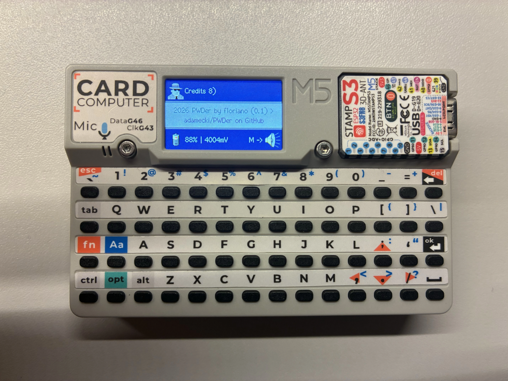

## Password import screen
Once Cardputer finds `/pwimport` file during startup on the SD card, this screen will be shown after entering the password. Press Y to import the passwords or N to delete the file and keep current passwords. Keep in mind that there is no appending passwords yet - when importing new passwords, everything will be overwritten with the new ones!

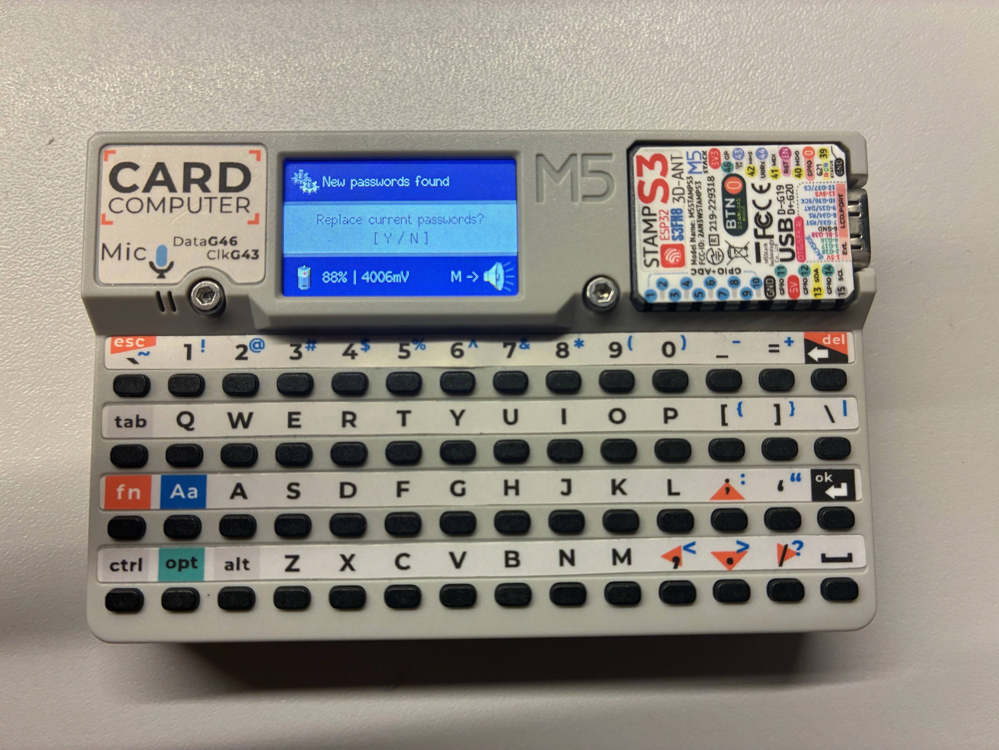

# Other languages
- Polish will be available for download from my website soon.
# Be careful!
While data stored on the device is encrypted, the import file and network synchronization aren't! I highly discourage using the network synchronization feature at all.
# Roadmap
In future versions, I plan to include these features:
- Manual password adding
- Exporting passwords from the device
- Encrypted password importing and synchronizing over network
- Encryption key stored in Cardputer's non-volatile memory instead of the program, and the ability to randomize/change it from options screen
# Credits
- [ESP32-Encrypt](https://github.com/josephpal/esp32-Encrypt) - an easy-to-use library for AES128 encryption
