# PWDer
PWDer is a simple password manager for the M5Cardputer. Its name is a combination of a few words:
- PWD (password)
- Manager
- Cardputer

and in order to not break your tongue, you can pronounce it as "Powder".


<br>

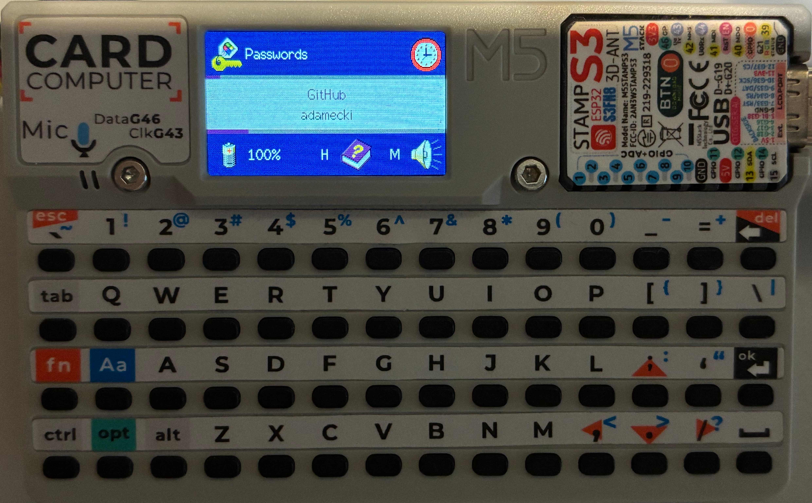

It started as an idea to solve the problem of the meticulous process of logging into personal accounts on different public computers (like school or work), where you don't have your password manager. It simulates a keyboard, entering the passwords for you into every computer you plug it in to. I thought of portable / cloud password managers only when I was halfway through doing this project, so I decided to continue it.
# Key functionalities
- Storing up to 100 login + password + otp entries using AES128 encryption
- Protection with master password (PBKDF2 key derivation)
- Searching for passwords by entry name
- Automatic password input to your computer using USB cable or Bluetooth
- Synchronizing with .kdbx (KeePass) files over USB cable
- Support for TOTP two-factor authentication
- Fun, simple design

# Limitations
- Currently, only ASCII characters are supported
- Simultaneous use of Wi-Fi and Bluetooth is impossible. If you want to use 2FA with Bluetooth, please use M5Unit RTC.

# Setting it up
## Prerequisites
- I highly recommend using [Launcher](https://github.com/bmorcelli/Launcher) for running the program. However, it can be flashed and used directly too.
- A .kdbx database is required to import passwords into the Cardputer. Your computer also has to be able to run Python scripts. (This requirement will disappear once I add manual password entering)
## Step 1: Preparing the SD card
- Format an SD card using the **FAT32** file system
## Step 2a: Installing PWDer on the Cardputer (binary)
- Download the binary from the Releases page and put it on your SD card or upload it directly to the ESP32.
## Step 2b: Building PWDer from source
- Set up [PlatformIO](https://platformio.org/install).
- Clone the repository

```bash
git clone --recursive https://github.com/adamecki/PWDer
cd PWDer
git submodule init
```

- Open cloned directory in PlatformIO. The IDE should pull required libraries automatically.
- Build the program and either upload it to the device or find its binary (`PROJECT_DIR/pio/build/m5stack-stamps3/firmware.bin`).

### Important
While compiling, you may encounter a compilation error like this:
```
lib/ESP32-BLE-CompositeHID/DualSenseGamepadDevice.cpp: In memberfunction 'void DualsenseGamepadDevice::timestamp()':
lib/ESP32-BLE-CompositeHID/DualSenseGamepadDevice.cpp:657:23: error: 'esp_cpu_get_cycle_count' was not declared in this scope
     uint32_t cycles = esp_cpu_get_cycle_count() / 1500;
                       ^~~~~~~~~~~~~~~~~~~~~~~
lib/ESP32-BLE-CompositeHID/DualSenseGamepadDevice.cpp:657:23: note: suggested alternative: 'esp_cpu_get_ccount'
     uint32_t cycles = esp_cpu_get_cycle_count() / 1500;
                       ^~~~~~~~~~~~~~~~~~~~~~~
                       esp_cpu_get_ccount
*** [.pio/build/m5stack-stamps3/lib546/ESP32-BLE-CompositeHID/DualSenseGamepadDevice.cpp.o] Error 1
```
To resolve it, open the file by Ctrl+clicking (or Cmd+clicking on Mac) on the file `DualSenseGamepadDevice.cpp` (not `.o`!) and in line 657 change `esp_cpu_get_cycle_count()` to `esp_cpu_get_ccount()`.

- *Optional: If you chose the second option, move the exported .bin file to the SD card*
- Make sure the SD card is in, then turn on the Cardputer
## Step 3: First run
- If you're using launcher, install the .bin file. Otherwise, wait until the program asks for the password.
- The first run password is "default". Enter it and press OK, you'll see the "Sample Entry" screen - the default and only password entry if the passwords file was nonexistent.
## Step 4: Importing the passwords for the first time
- Prepare your .kdbx database
- Open your terminal in `pwder_keepass_sync` directory
- Create a Python virtual environment and install dependencies

macOS / Linux:
```bash
python3 -m venv .
source ./bin/activate
pip install cryptography pykeepass pyserial
```

Windows:
```cmd
python -m venv .
Scripts\activate.bat
pip install cryptography pykeepass pyserial
```

(next time you try to use the script, just enter `source ./bin/activate` or `Scripts\activate.bat`)
- Connect the Cardputer to your computer using the USB cable (make sure PWDer is running and unlocked).
- Run the script

macOS / Linux:
```bash
python3 sync.py /your/database.kdbx
```

Windows:
```cmd
python sync.py C:\your\database.kdbx
```

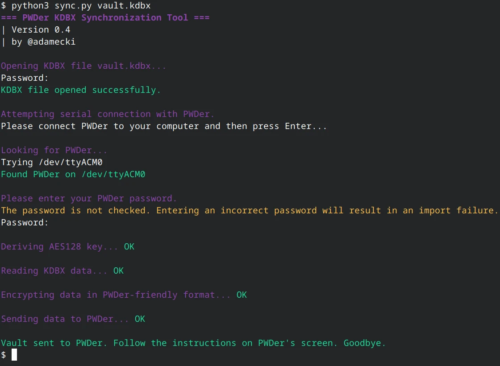

- The script will prompt you for both your KDBX password and PWDer password. Enter them and then press Y on the Cardputer to import your vault.

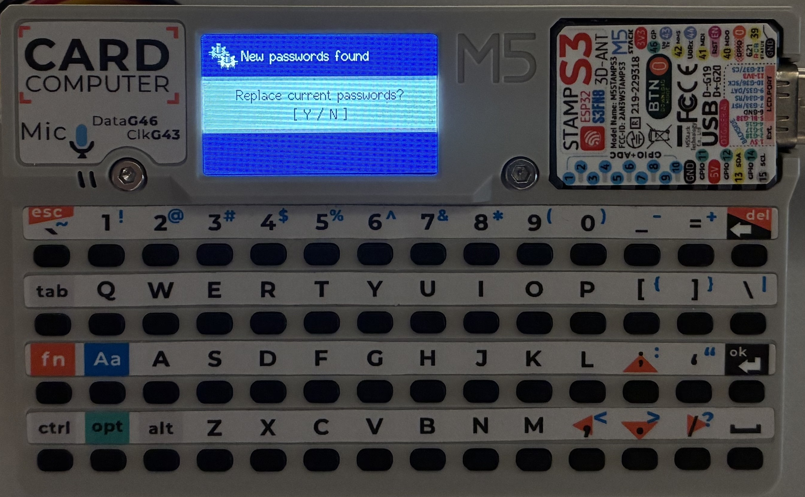

<b>Remember that your user should have the serial port privileges (like belonging to the `dialout` group on Linux)!</b>

# Usage
## Main screen
This is where you can select a password to enter. The top bar represents the vault usage in %, and the bottom one is a scrollbar.

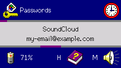


Press the arrow keys to navigate, and hold down V to preview the password / OTP you're about to enter. Other keybinds:

- `1` - enter the username for currently selected entry
- `2` - enter the password
- `3` - enter the username, then press TAB, then enter the password, and then press Enter
- `4` - enter current TOTP
- `Enter` - perform one of these three actions, depending on the selection made in Options.

- `T` - simulate pressing TAB on the computer.
- `R` - simulate pressing Enter on the computer.

- `M` - mute or unmute the speaker. The default state for the speaker is muted.
- `L` - lock the device. Alternatively, you can just reset the device.

- `N` - connect (or reconnect) Wi-Fi
- `B` - enable Bluetooth connectivity (only one of Wi-Fi / Bluetooth can work at the same time)

- `O` - open Options.
- `C` - open About page.
- `Q` - open Search menu (press Fn+Esc to exit)

- `FN` + `Top button` - screenshot (will be saved as BMP in the SD card root directory)

If navigating with Arrow keys / Esc doesn't work, press FN alongside them.

## Bluetooth
### Introduction
PWDer can simulate a Bluetooth keyboard to input passwords to your computer without a cable.

### Usage
Press B on Cardputer's main screen. The device should instantly become visible to a computer.

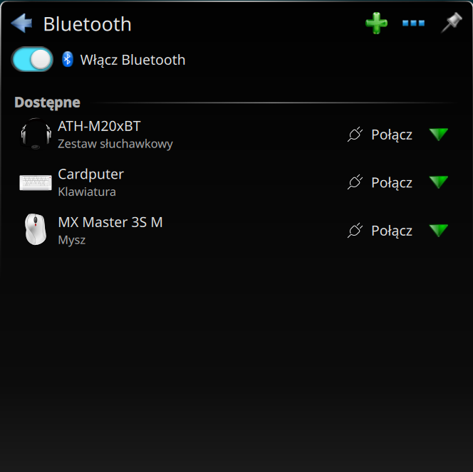

Connect, and PWDer should display a Bluetooth icon in the top right corner.

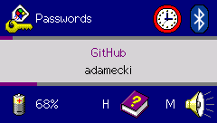

Remember that currently using Wi-Fi and Bluetooth simultaneously in PWDer is currently impossible. If you encounter an error enabling Wi-Fi or Bluetooth, restart PWDer and enable only the connectivity you intend to use at the time.

### Connecting to a new device
Forget the device on any connected host and restart PWDer, enabling Bluetooth. It should be visible in the devices list again.

### Disclaimer
Keep in mind that every wireless connection is captured with much more ease than a wired one. Use Bluetooth only in safe environments, and at your own risk!

## TOTP
### Introduction
PWDer supports two-factor authentication using six-digit one time password.

Neither ESP32, nor Cardputer do have an RTC backup battery to keep the time correct even when the device is powered off. Currently, there are two options to use time-based one-time passwords with PWDer.

### First solution: M5Unit RTC
If you have an M5Unit RTC, connect it to Cardputer's Grove connector before starting PWDer. It will detect the unit and display a small clock icon in the top right corner. It means that Cardputer is using RTC for generating TOTP.

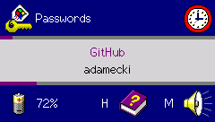

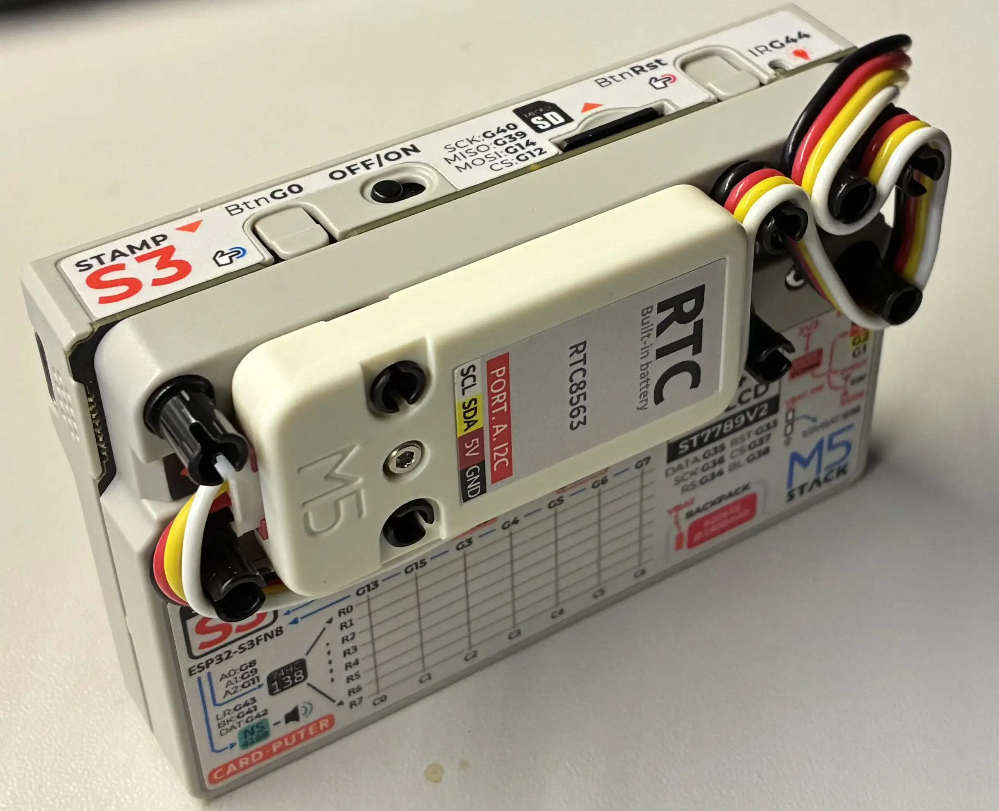

If your RTC clock is not set correctly, you can synchronize its time with network in the Options (look below). In the future, setting time manually will also be possible.

*Notice: Don't connect any other units to the Grove connector while PWDer is running. It hasn't been tested, but Cardputer might read it incorrectly as an M5Unit RTC and give incorrect time-based one-time passwords.

### Second solution: NTP network time
The Cardputer can to connect to an NTP server via Wi-Fi in order to synchronize time, so it can generate a TOTP. For now, the default pool.ntp.org NTP server for the NTP client library is used, but in the future there will be a way to change the NTP server directly from PWDer's UI. For now the only way to change an NTP server is editing the code.

With that said, even if you have a TOTP secret in your database, PWDer won't show the TOTP if it doesn't have a time provider. If both RTC and NTP are available, Cardputer uses RTC as the primary time provider, as it is more reliable (works offline).

### How to add a TOTP secret to my entry?
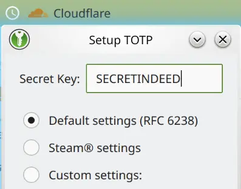
KeePassXC supports TOTP. If a secret key for your entry is set, the Python vault extraction script provided in the `pwder_keepass_sync` directory will find it and place it in your import file for PWDer. Just like passwords, it is stored on the SD card in an encrypted form (excluding the import phase for now).

Otherwise, if you're writing an import file manually, you can add the secret key as the fourth line of each entry, as described earlier.

### Where do I find the TOTP in PWDer's UI?
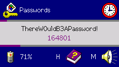
If the NTP requirements are met and your entry has a TOTP secret set, the entry title will be blue. After that, you can hold `v` to display the one time password: it will show on the right side of your username, or press `4` to enter it to your computer.

## Lock screen
Here you have to enter the correct password (then press OK) to access the device. If you've locked yourself out, you can remove the `pwder/config` file from the SD card (the password will be "default" again), but keep in mind that all your saved passwords and configuration will disappear!

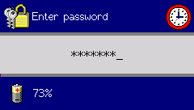

## Handbook
The handbook is a quick guide to all the keybindings. Press the arrow keys / esc to navigate.

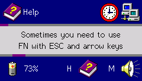

## Options
Press O to open the options.

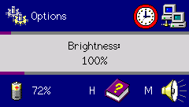

Press FN + Arrow keys to change the brightness. Remember that you need to apply this setting with Enter!

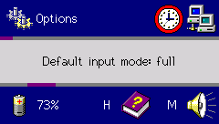

Press Enter to switch between default credential input modes.

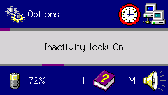

Press Enter to switch the inactivity lock on or off. The screen will dim after 15s, go blank after 20s and lock itself after 30s of inactivity.

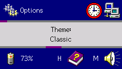

Press Enter to switch color schemes. Look below to see the available ones.

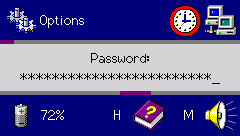

Here you can change the device's master password. Type it, press Enter, then enter the old password.

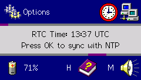

Here you can synchronize the time with NTP for the M5Unit RTC. Notice that the time shown is UTC, not local time!

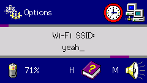

Wi-Fi SSID for NTP connection.

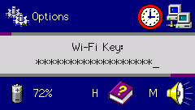

Wi-Fi password for NTP connection.

## About page
Press the arrow keys / esc to navigate. Pressing Enter will input the link to the selected thing (preferably to the browser).


## Repaint PWDer!
Seven default color schemes are available. File `include/gui.h` contains their definitions.

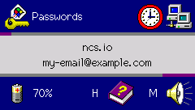

Classic

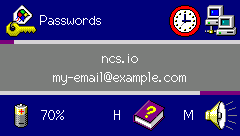

Classic Dark

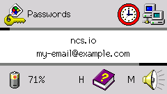

Industrial

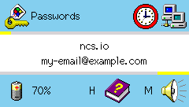

Sky


Garden

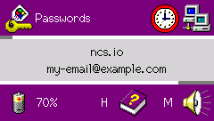

Elegant


L33t H4xx0r

# Other languages
- Polish is available. To change a language, recompile PWDer with `#define lang_pl` instead of default `#define lang_en` in line 23 of the file `include/globals.h`.

# Roadmap
In future versions, I plan to include these features:
- Manual password adding
- Wireless password synchronization via Wi-Fi
